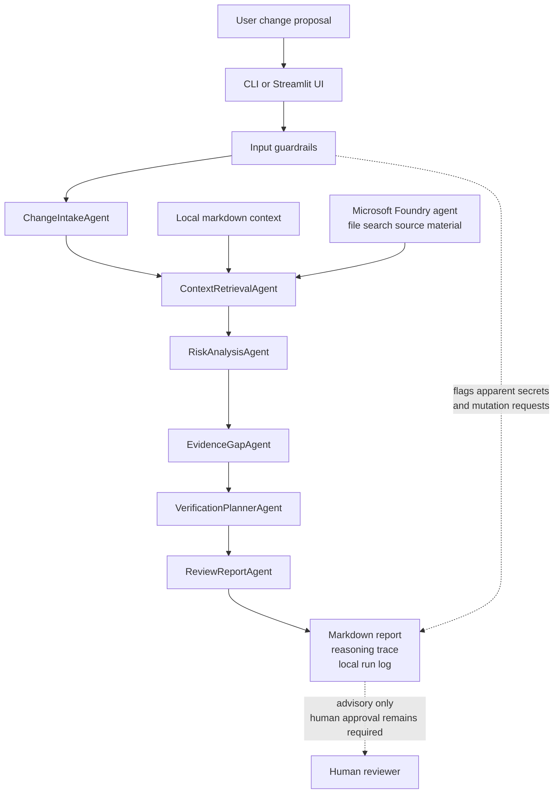

<div align="center">

[](#readme "Themis")
[](#readme "Reasoning Agents")
[](src/themis/contracts.py "Typed contracts")

[](pyproject.toml "Python")
[](app.py "Streamlit UI")
[](docs/testing.md "Testing")
[](LICENSE "Licence")

</div>

Themis is a read-only reasoning agent for infrastructure change review. It reviews proposed infrastructure changes before deployment and produces structured notes on risks, missing evidence, verification steps, rollback questions and confidence level.

It is built for the Microsoft Agents League Reasoning Agents track. The project is intentionally narrow: it helps a human reviewer decide whether a proposed infrastructure change is ready for approval.

Section | Start here for
:-- | :--
[What Themis is](#what-themis-is) | project scope
[Quick start](#quick-start) | deterministic local demo
[Example input](#example-input) | main risky scenario
[Example output](#example-output) | checked-in sample reports
[Architecture](#architecture) | six-agent pipeline
[Microsoft IQ and Foundry](#microsoft-iq-and-foundry) | mock retrieval, Foundry adapter and verification boundary
[Safety model](#safety-model) | guardrails and human approval
[Documentation](#documentation) | deeper project documents
[Demo video](#demo-video) | recording link
[Project structure](#project-structure) | repository layout
[Tests](#tests) | verification commands
[Limitations](#limitations) | current limits

## What Themis is

Themis is a pre-change review assistant for infrastructure work. It separates facts from assumptions, retrieves relevant context, ranks risks, identifies missing evidence, proposes verification steps and asks rollback questions.

The output is advisory. A human reviewer still approves, rejects or asks for more information.

## Quick start
```powershell
uv sync
uv run pytest
uv run streamlit run app.py
```

The default demo uses deterministic local context retrieval:
```powershell
uv run themis-review samples/change_risky.md
```

Each CLI review saves a local run log under `.themis/runs/`. The log contains the rendered report, structured report data, proposal path and retrieval mode so prior reviews can be revisited without re-running the agent.
```powershell
uv run themis-review --list-runs
uv run themis-review --show-run .themis/runs/<run-log>.json
```

To run the guided setup wizard:
```powershell
uv run themis-setup
```

The setup assistant checks Azure CLI, login state, visible Azure subscriptions, optional Foundry dependencies, project endpoint and agent ID. It then prompts for each setup value and can apply the Azure setup, use or create the Foundry resource/project, create the model deployment if needed and create the Foundry agent after confirmation.

For narrower setup steps:
```powershell
uv run themis-setup check
uv run themis-setup --login check
uv run themis-setup azure-subscription-check
uv run themis-setup azure-subscription-check --apply
uv run themis-setup setup-agent
uv run themis-setup attach-sources
```

The Azure step prompts for subscription, resource group and region. The wizard then prompts for the Foundry resource, project and model deployment names, uses existing resources where present and creates missing resources when confirmed. It saves non-secret local configuration under `.themis/`.

`attach-sources` uploads the sample architecture, network policy and deployment runbook context into a Foundry vector store and updates the configured agent with file search. Setup can create billable cloud resources. Use `uv run themis-setup check` for a non-mutating diagnostic pass.

## Example input

The main demo scenario is a proposed change that exposes an internal admin service through a public Azure Application Gateway, updates network access and deploys during business hours.

Themis highlights public exposure, unclear authentication, broad source ranges, missing owner approval, missing rollback verification and missing post-change checks.

## Example output

Sample reports are kept under `outputs/`:
- [safe_review.md](outputs/safe_review.md)
- [risky_review.md](outputs/risky_review.md)
- [incomplete_review.md](outputs/incomplete_review.md)

The risky report is the main demo path because it shows risk ranking, missing evidence, verification planning, rollback questions and the advisory recommendation model.

## Architecture


## Microsoft IQ and Foundry

The project has a stable retrieval interface:
```python
retrieve_context(query, mode="mock" | "foundry")
```

Mock mode reads local markdown context and is used for tests and the guaranteed demo path. Mock context includes citations to the local source files.

Foundry mode is optional and requires Microsoft Foundry configuration. The adapter returns the same `RetrievedContext` contract as mock mode. The setup default uses a `gpt-4.1-mini` `GlobalStandard` deployment at capacity `10` to avoid the one-capacity `gpt-4o` rate limit hit during local testing.

The setup wizard creates new agents with source material attached when the sample context files are present. For an existing agent, run:
```powershell
uv run themis-setup attach-sources
```

Source attachment and the post-attachment Foundry review path have been tested locally. The current environment completed `uv run themis-review samples\change_risky.md --context-mode foundry` after the configured agent was moved to the `gpt-4.1-mini` deployment.

That smoke test proves the configured Foundry agent can return context through the Themis contract after source material has been attached. It does not by itself prove source-level citation rendering. The project must not claim full Foundry IQ grounding with citations unless that path is tested and recorded in [foundry_verification.md](docs/foundry_verification.md).

Use `uv run themis-setup check` to diagnose missing Azure or Foundry setup without running the wizard. If no subscription is visible, the tool explains that this is an Azure subscription requirement, not a software licence requirement. It also links to Microsoft's Azure account and free services pages.

## Safety model

Themis flags apparent secrets, private keys, tokens and requests to deploy, scan live systems, exploit, bypass approval, suppress logging or hide risk. Guardrail findings are included in the report, sensitive excerpts are redacted in saved run logs and a positive recommendation is prevented.

Every report must include verification steps, rollback questions and a human approval reminder.

## Documentation

Project documentation is organised under [docs/README.md](docs/README.md):
- [architecture.md](docs/architecture.md), pipeline, contracts and retrieval boundary
- [safety_model.md](docs/safety_model.md), guardrails and read-only review boundary
- [iq_integration.md](docs/iq_integration.md), mock retrieval, Foundry setup and current IQ limits
- [foundry_verification.md](docs/foundry_verification.md), current Foundry smoke-test evidence and IQ boundary
- [testing.md](docs/testing.md), expected checks and coverage targets
- [limitations.md](docs/limitations.md), non-goals and current limits

## Demo video

The project has a working local demo path through both the CLI and Streamlit UI. The Foundry agent adapter path has also been smoke-tested locally.

Demo video: to be added.

## Project structure

Path | Purpose
:-- | :--
`app.py` | Streamlit demo interface
`src/themis/contracts.py` | Pydantic handoff and report contracts
`src/themis/pipeline.py` | six-stage review pipeline
`src/themis/agents/` | intake, risk, evidence, verification and report stages
`src/themis/iq.py` | mock and Foundry context retrieval interface
`src/themis/setup.py` | Azure and Foundry setup assistant
`samples/` | synthetic changes and local context
`outputs/` | sample generated reports
`docs/` | architecture, safety, setup, testing and limitations
`tests/` | contract, guardrail, pipeline, setup and report tests

## Tests
```powershell
uv run pytest
```

Tests cover contracts, guardrails, deterministic mock pipeline output, report sections and Foundry configuration failure.

## Limitations

The sample scenarios are synthetic. The default mode is deterministic and local. Themis is advisory and intentionally avoids live infrastructure access.
