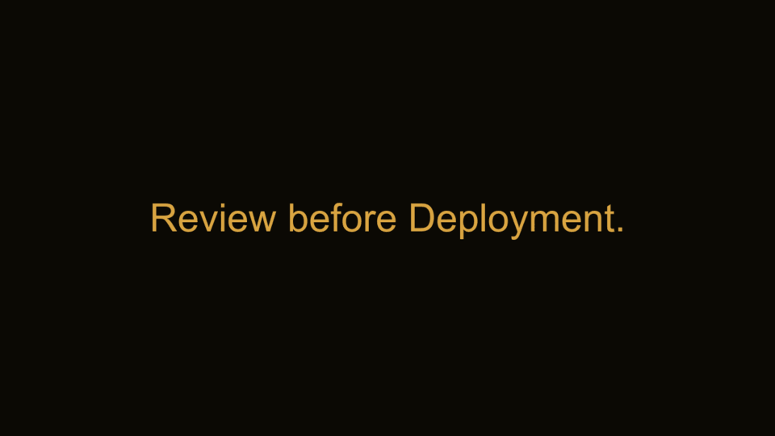
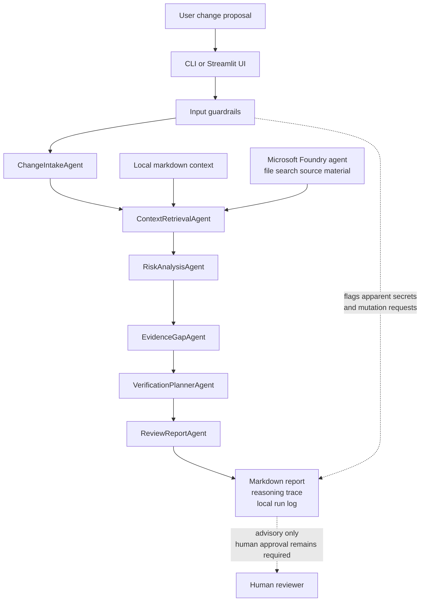

<div align="center">



[](#readme "Themis")
[](#readme "Reasoning Agents")
[](src/themis/contracts.py "Typed contracts")

[](pyproject.toml "Python")
[](app.py "Streamlit UI")
[](docs/testing.md "Testing")
[](LICENSE "Licence")

</div>

Themis is a read-only reasoning agent for infrastructure change review. It reviews proposed infrastructure changes before deployment and produces structured notes on risks, missing evidence, verification steps, rollback questions and confidence level.

It is built for the Microsoft Agents League Reasoning Agents track. The project is intentionally narrow: it helps a human reviewer decide whether a proposed infrastructure change is ready for approval.

Section | Start here for
:-- | :--
[What Themis is](#what-themis-is) | project scope
[Why Themis matters](#why-themis-matters) | practical need
[Quick start](#quick-start) | deterministic local demo
[Example input](#example-input) | main risky scenario
[Example output](#example-output) | checked-in sample reports
[Architecture](#architecture) | six-agent pipeline
[Microsoft IQ and Foundry](#microsoft-iq-and-foundry) | mock retrieval, Foundry retrieval and verification scope
[Safety model](#safety-model) | guardrails and human approval
[Public-interest use case](#public-interest-use-case) | community infrastructure review
[Screen reader and WCAG-oriented design](#screen-reader-and-wcag-oriented-design) | CLI, Markdown and accessible review output
[Judging alignment](#judging-alignment) | how the project maps to the rubric
[Documentation](#documentation) | deeper project documents
[Project structure](#project-structure) | repository layout
[Tests](#tests) | verification commands
[Limitations](#limitations) | current limits
[Demo media](#demo-media) | final video and README media

## What Themis is

Themis is a pre-change review assistant for infrastructure work. It separates facts from assumptions, retrieves relevant context, ranks risks, identifies missing evidence, proposes verification steps and asks rollback questions.

The output is advisory. A human reviewer still approves, rejects or asks for more information.

## Why Themis matters

Infrastructure changes often fail before the deployment starts: the change record does not name the exposure boundary, the rollback path is vague, owner approval is missing or the post-change checks only prove that something responds. Themis turns that kind of proposal into review material a human can act on before users are affected.

The project is deliberately read-only. It does not deploy, scan, mutate cloud resources or replace approval. Its value is in making the reasoning visible: what is known, what is assumed, what is missing, what should be verified and what should stop the change from being treated as ready.

## Quick start
```powershell
uv sync
uv run pytest
uv run streamlit run app.py
```

The default demo uses deterministic local context retrieval:
```powershell
uv run themis-review samples/change_risky.md
```

Each CLI review saves a local run log under `.themis/runs/`. The log contains the rendered report, structured report data, proposal path and retrieval mode so prior reviews can be revisited without re-running the agent.
```powershell
uv run themis-review --list-runs
uv run themis-review --show-run .themis/runs/<run-log>.json
```

To run the guided setup wizard:
```powershell
uv run themis-setup
```

The setup assistant checks Azure CLI, login state, visible Azure subscriptions, optional Foundry dependencies, project endpoint and agent ID. It then prompts for each setup value and can apply the Azure setup, use or create the Foundry resource/project, create the model deployment if needed and create the Foundry agent after confirmation.

For narrower setup steps:
```powershell
uv run themis-setup check
uv run themis-setup --login check
uv run themis-setup azure-subscription-check
uv run themis-setup azure-subscription-check --apply
uv run themis-setup setup-agent
uv run themis-setup attach-sources
```

The Azure step prompts for subscription, resource group and region. The wizard then prompts for the Foundry resource, project and model deployment names, uses existing resources where present and creates missing resources when confirmed. It saves non-secret local configuration under `.themis/`.

`attach-sources` uploads the sample architecture, network policy and deployment runbook context into a Foundry vector store and updates the configured agent with file search. Setup can create billable cloud resources. Use `uv run themis-setup check` for a non-mutating diagnostic pass.

## Example input

The main demo scenario is a proposed change that exposes an internal admin service through a public Azure Application Gateway, updates network access and deploys during business hours.

Themis highlights public exposure, unclear authentication, broad source ranges, missing owner approval, missing rollback verification and missing post-change checks.

## Example output

Sample reports are kept under `outputs/`:
- [safe_review.md](outputs/safe_review.md)
- [risky_review.md](outputs/risky_review.md)
- [incomplete_review.md](outputs/incomplete_review.md)
- [clinic_admin_portal_review.md](outputs/clinic_admin_portal_review.md)

The risky report is the main demo path because it shows risk ranking, missing evidence, verification planning, rollback questions and the advisory recommendation model.

## Architecture


## Microsoft IQ and Foundry

The project has a stable retrieval interface:
```python
retrieve_context(query, mode="mock" | "foundry")
```

Mock mode reads local markdown context and is used for tests and the guaranteed demo path. Mock context includes citations to the local source files.

Foundry mode is optional and requires Microsoft Foundry configuration. It returns the same `RetrievedContext` contract as mock mode. The verified sample path uses a `gpt-4.1-mini` `GlobalStandard` deployment at capacity `10`.

The setup wizard creates new agents with source material attached when the sample context files are present. For an existing agent, run:
```powershell
uv run themis-setup attach-sources
```

Source attachment, the post-attachment Foundry review path and source-level citation rendering have been tested with the included sample source material.

That verification shows the configured Foundry agent can return context through the Themis contract after source material has been attached and can render source-level file-search citations for the included sample source material. The evidence and scope are in [foundry_verification.md](docs/foundry_verification.md).

Use `uv run themis-setup check` to diagnose missing Azure or Foundry setup without running the wizard. If no subscription is visible, the tool explains that this is an Azure subscription requirement, not a software licence requirement. It also links to Microsoft's Azure account and free services pages.

## Safety model

Themis flags apparent secrets, private keys, tokens and requests to deploy, scan live systems, exploit, bypass approval, suppress logging or hide risk. Guardrail findings are included in the report, sensitive excerpts are redacted in saved run logs and a positive recommendation is prevented.

Every report must include verification steps, rollback questions and a human approval reminder.

## Public-interest use case

Themis is useful for public-interest infrastructure where a small team may not have dedicated platform-security review capacity. A school, clinic, council team or nonprofit can use Themis to turn a proposed infrastructure change into structured review material before deployment: risks, missing evidence, verification steps, rollback questions and human-review notes.

The checked-in clinic sample shows this pattern with a synthetic appointment-admin portal exposure. Themis does not approve or deploy the change. It helps reviewers ask better questions before a change affects staff, patients, students or residents.

## Screen reader and WCAG-oriented design

Themis provides both CLI and browser workflows so review material is not locked inside a visual-only interface. Review output is available as Markdown, uses text labels rather than colour-only severity, includes structured headings and can be saved into tickets, Git history or plain-text review workflows.

The Markdown report is intended to remain readable when used with a screen reader or reviewed linearly in plain text. The normal `Report` tab includes a labelled `Markdown report` text area and Markdown download, so reviewers do not have to rely on dataframe views.

The project does not claim completed WCAG compliance or certification. It does follow WCAG-oriented practices where practical: labelled controls, keyboard-operable workflows, visible focus, strong contrast, text alternatives for media and no colour-only risk signalling.

## Judging alignment

Criterion | Themis evidence
:-- | :--
Accuracy and relevance | Reviews a realistic infrastructure-change problem and produces concrete risks, missing evidence, verification steps and rollback questions.
Reasoning and multi-step thinking | Uses a six-stage pipeline with typed handoffs, facts, assumptions, retrieved context, risk ranking and a reasoning trace.
Creativity and originality | Focuses on pre-change infrastructure judgement rather than acting as a deployment bot or generic chatbot.
User experience and presentation | Provides a CLI path, Streamlit UI, sample selector, Markdown export, checked sample outputs and public docs.
Reliability and safety | Keeps the tool read-only, flags secrets and mutation requests, redacts sensitive saved logs and keeps human approval required.
Community value | Helps small public-interest teams structure infrastructure review before changes affect users.

## Documentation

Project documentation is organised under [docs/README.md](docs/README.md):
- [architecture.md](docs/architecture.md), pipeline, contracts and retrieval boundary
- [safety_model.md](docs/safety_model.md), guardrails and read-only review boundary
- [iq_integration.md](docs/iq_integration.md), mock retrieval, Foundry setup and verification scope
- [foundry_verification.md](docs/foundry_verification.md), Foundry sample-source citation evidence
- [public_interest_use_case.md](docs/public_interest_use_case.md), public-interest infrastructure review example
- [accessibility.md](docs/accessibility.md), screen reader support and WCAG-oriented design
- [testing.md](docs/testing.md), expected checks and coverage targets
- [limitations.md](docs/limitations.md), non-goals and current limits

## Project structure

Path | Purpose
:-- | :--
`app.py` | Streamlit demo interface
`src/themis/contracts.py` | Pydantic handoff and report contracts
`src/themis/pipeline.py` | six-stage review pipeline
`src/themis/agents/` | intake, risk, evidence, verification and report stages
`src/themis/iq.py` | mock and Foundry context retrieval interface
`src/themis/setup.py` | Azure and Foundry setup assistant
`samples/` | synthetic changes and local context
`outputs/` | sample generated reports
`docs/` | architecture, safety, setup, testing and limitations
`tests/` | contract, guardrail, pipeline, setup and report tests

## Tests
```powershell
uv run pytest
```

Tests cover contracts, guardrails, deterministic mock pipeline output, report sections, local run logs, Foundry configuration failure, citation extraction and CLI Unicode output.

## Limitations

The sample scenarios are synthetic. The default mode is deterministic and local. Themis is advisory and intentionally avoids live infrastructure access.

## Demo media

The project has a working local demo path through both the CLI and Streamlit UI. The Foundry-backed sample-source retrieval path has also been verified locally with source-level citations.

README media is stored under `.github/assets/`:
- [themis-demo.gif](.github/assets/themis-demo.gif), short README walkthrough
- [themis-review.png](.github/assets/themis-review.png), review input screen
- [themis-report.png](.github/assets/themis-report.png), report summary and risk table
- [themis-markdown-report.png](.github/assets/themis-markdown-report.png), linear Markdown report
- [themis-reasoning-trace.png](.github/assets/themis-reasoning-trace.png), reasoning trace
- [themis-safety-model.png](.github/assets/themis-safety-model.png), safety model

Demo video: to be added.
