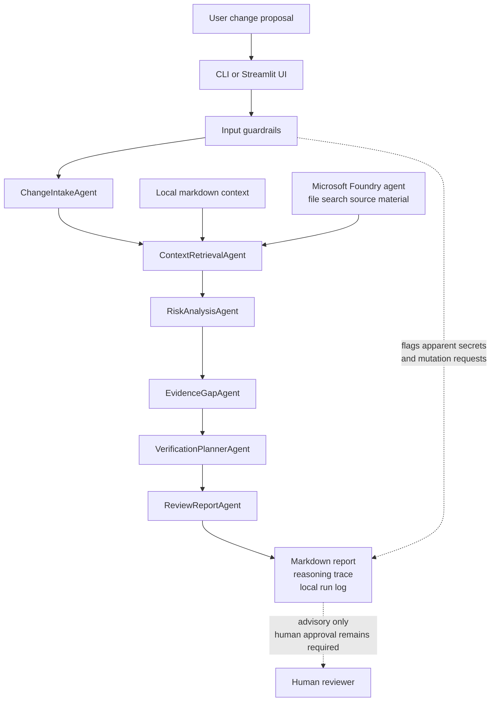

# Architecture

Themis is a typed, read-only reasoning pipeline.


Guardrails run before the report is produced. They flag apparent secrets and mutation-oriented requests, include those findings in the report, redact sensitive excerpts in saved logs and prevent a positive recommendation. The final report remains advisory.

# Product boundary

Themis helps a human reviewer examine an infrastructure change before deployment. The review pipeline does not deploy infrastructure, scan live systems, mutate cloud resources or replace an approval process.

The current implementation accepts proposal text plus local or Foundry-backed context retrieval. It returns a structured advisory report with recommendation, confidence, facts, assumptions, risks, missing evidence, verification steps, rollback questions and reasoning trace.

# Current pipeline

The current review pipeline is:
```text
proposal text
  -> input guardrail inspection
  -> ChangeIntakeAgent
  -> ContextRetrievalAgent
  -> RiskAnalysisAgent
  -> EvidenceGapAgent
  -> VerificationPlannerAgent
  -> ReviewReportAgent
  -> ReviewReport
  -> Markdown report
```

The pipeline is deliberately sequential. Each stage receives typed data from the previous stage and returns a contract that can be tested without a live cloud account.

# Agent stages

`ChangeIntakeAgent` parses the submitted change into `ChangeProposal`. It extracts service, environment, change type, affected components, network exposure, identity change notes, data sensitivity, deployment window, rollback state, provided evidence and raw text.

`ContextRetrievalAgent` retrieves policy, architecture and runbook context. Mock mode reads local markdown files from `samples/`. Foundry mode uses the configured Foundry agent and returns the same `RetrievedContext` contract. IQ-grounded retrieval should only be claimed when the agent has configured source material and the run has been verified.

`RiskAnalysisAgent` identifies security, reliability and operational risks. Current categories include network exposure, identity/authentication, logging/observability, rollback and deployment window risk. Retrieved context can add explicit policy or runbook evidence to risk findings when the proposal conflicts with that context.

`EvidenceGapAgent` finds missing information that should be resolved by the owner or reviewer. Current gaps include authentication model, rollback plan, owner approval, approved source ranges and post-change verification. It can use context-backed risks to explain why a missing item matters.

`VerificationPlannerAgent` creates pre-change, post-change and rollback verification steps. The output is advisory: it asks what should be checked rather than running commands.

`ReviewReportAgent` produces the final `ReviewReport`. It sets a restrained recommendation, reduces confidence when evidence is missing and adds human-review notes.

# Contracts

The main public contracts are defined in `src/themis/contracts.py`.
- `ChangeProposal`
- `RetrievedContext`
- `RiskFinding`
- `EvidenceGap`
- `VerificationStep`
- `ReviewReport`
- `ReasoningTraceStep`

The recommendation states are deliberately review-oriented:
```text
APPROVE WITH CONDITIONS
REVIEW REQUIRED
DO NOT PROCEED YET
INSUFFICIENT EVIDENCE
```

Themis does not emit `SAFE`, `UNSAFE` or automatic approval language. Humans approve.

# Retrieval boundary

Mock and Foundry retrieval share the same downstream interface:
```python
retrieve_context(query, mode="mock" | "foundry") -> list[RetrievedContext]
```

Downstream agents do not need to know whether the context came from local markdown files or Microsoft Foundry. This keeps the demo deterministic while allowing a live Foundry-backed path when credentials and quota are available. Retrieved context can include citations so reports can name local context files or Foundry file-search source material.

# User interfaces

The command-line interface runs one proposal at a time and saves local run history under `.themis/runs/`. The Streamlit interface exposes the planned five-tab demo surface:
- Review
- Sample scenarios
- Report
- Reasoning trace
- Safety model

Both interfaces use the same `run_review()` pipeline.

# Setup boundary

`themis-setup check` is diagnostic. The interactive setup wizard can create Azure resource groups, Foundry resources, model deployments and Foundry agents after confirmation. That setup path exists to prepare the demo environment; it is not part of the infrastructure-change review pipeline.
